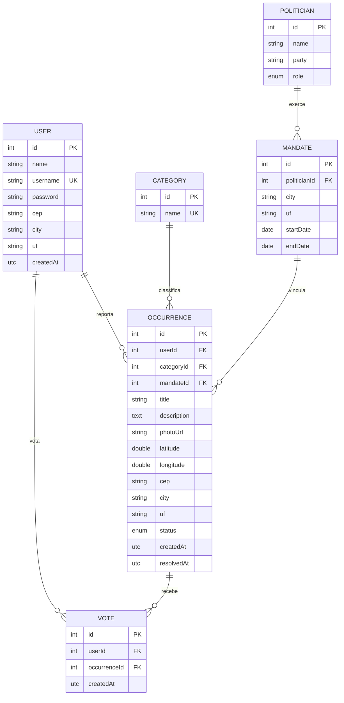
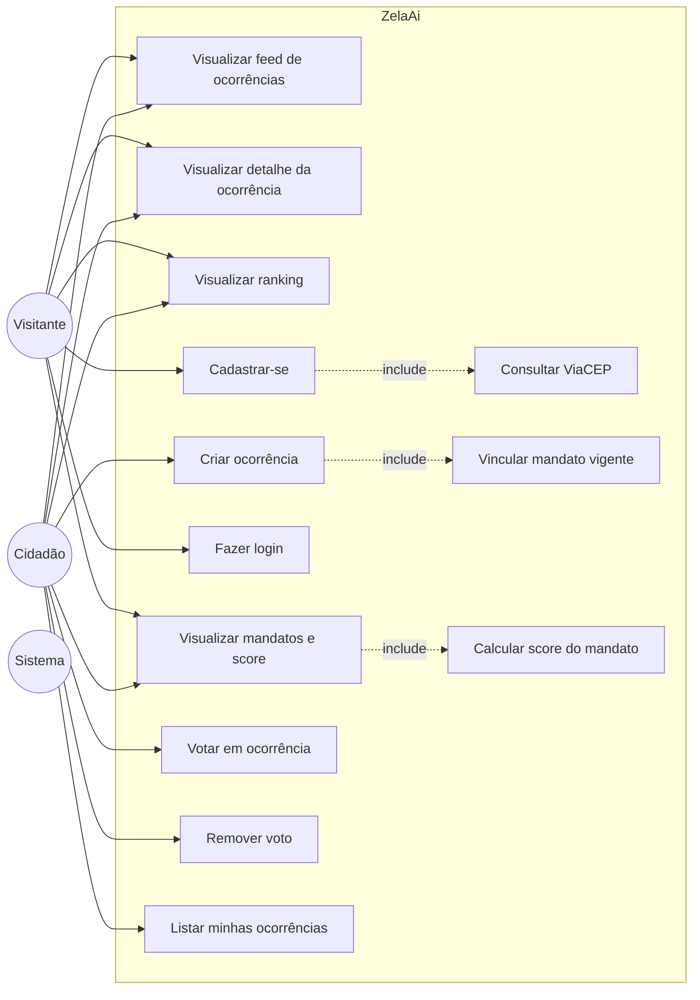

# ZelaAi — Documentação do Projeto

Plataforma colaborativa de zeladoria pública. "Reclame Aqui" da infraestrutura urbana, com ranking comunitário e termômetro de gestão dos políticos.

---

## 1. Escopo do Projeto

### 1.1 O Problema (A Dor)

Atualmente, as reclamações da população sobre infraestrutura urbana (buracos nas vias, iluminação defeituosa, vazamentos de esgoto crônicos) ficam diluídas em redes sociais. Esses relatos não possuem estrutura de dados, perdem-se no tempo e não geram métricas reais. Como resultado, o cidadão não tem uma ferramenta centralizada para cobrar a prefeitura, e fica impossível medir de forma objetiva se o atual prefeito ou governador está, de fato, resolvendo os problemas da cidade durante o seu mandato.

### 1.2 A Solução

O **ZelaAi** é uma plataforma web colaborativa, atuando como o "Reclame Aqui" da zeladoria pública. O sistema permite que cidadãos reportem, visualizem e ranqueiem problemas de infraestrutura em sua comunidade.

### 1.3 Diferenciais e Regras de Negócio Chave

- **Acesso Híbrido**: qualquer pessoa pode acessar o feed público para visualizar o mapa e a lista de problemas da cidade (leitura aberta, alto volume de tráfego). Para postar uma nova ocorrência (com foto e texto) ou votar, é exigido cadastro simples.
- **Ranqueamento Comunitário**: o sistema empodera a população através de votos. Um buraco em uma avenida principal que recebe centenas de votos sobe no ranking de prioridade, deixando o impacto escancarado para o poder público.
- **Termômetro de Gestão**: o núcleo inteligente cruza a linha do tempo das ocorrências com os mandatos políticos. Cada problema é vinculado à gestão vigente. Se um problema é reportado e resolvido rapidamente, a gestão ganha pontos. Se um problema crônico atravessa anos sem solução, o sistema expõe o passivo da gestão. Resultado: um **score transparente** de resolução de problemas para cada político.

### 1.4 Arquitetura Técnica

Full-Stack conteinerizada (Docker) para escalabilidade e deploy:

- **Backend (Haskell)**: alta confiabilidade e processamento rigoroso das regras de negócio (cruzamento de mandatos × ocorrências, algoritmo de ranqueamento).
- **Banco de Dados (PostgreSQL)**: modelagem relacional avançada entre Usuários, Ocorrências, Votos e linha do tempo histórica de Gestões/Mandatos.
- **Frontend (JavaScript)**: interface ágil, Mobile-First, focada em UX e envio de evidências fotográficas.

### 1.5 Stack do Backend

| Camada | Tecnologia |
|---|---|
| Linguagem | Haskell (GHC 9.6) |
| HTTP / Roteamento | Servant + Warp |
| ORM | Persistent + persistent-postgresql |
| Banco | PostgreSQL |
| JWT | `jose` / `jwt` |
| Hash de senha | `bcrypt` |
| UUID | `uuid` |
| API CEP | ViaCEP (`http-client` + `aeson`) |
| Validação | módulos próprios em `Validation/*` |

---

## 2. Modelagem de Dados

### 2.1 Entidades

| Entidade | Descrição |
|---|---|
| **User** | Cidadão cadastrado. Pode criar ocorrências e votar. |
| **Category** | Tipo de problema (Buraco, Iluminação, Esgoto, Lixo, Calçada…). |
| **Occurrence** | Ocorrência reportada. Vinculada a um usuário, uma categoria e ao mandato vigente. |
| **Vote** | Voto de um usuário em uma ocorrência. Único por (user, occurrence). |
| **Politician** | Político (prefeito, governador). |
| **Mandate** | Período de mandato de um político em uma cidade/UF. Usado pelo termômetro. |

### 2.2 Atributos por entidade

```
User
  id              PK
  name            String
  username        String  UNIQUE
  password        String  (hash bcrypt)
  cep             String  (8 dígitos)
  city            String  (preenchido via ViaCEP)
  uf              String  (preenchido via ViaCEP)
  createdAt       UTCTime

Category
  id              PK
  name            String  UNIQUE

Occurrence
  id              PK
  userId          FK → User
  categoryId      FK → Category
  mandateId       FK → Mandate   (vigente na criação)
  title           String
  description     Text
  photoUrl        String          (URL/base64 — definir no front)
  latitude        Double          (opcional)
  longitude       Double          (opcional)
  cep             String
  city            String
  uf              String
  status          Enum (open | in_progress | resolved)
  createdAt       UTCTime
  resolvedAt      UTCTime?        (nullable)

Vote
  id              PK
  userId          FK → User
  occurrenceId    FK → Occurrence
  createdAt       UTCTime
  UNIQUE (userId, occurrenceId)

Politician
  id              PK
  name            String
  party           String
  role            Enum (prefeito | governador)

Mandate
  id              PK
  politicianId    FK → Politician
  city            String          (vazio se governador estadual)
  uf              String
  startDate       Day
  endDate         Day
```

### 2.3 Diagrama Entidade-Relacionamento



### 2.4 Regras de integridade

- `User.username` único.
- `Category.name` único.
- `Vote (userId, occurrenceId)` único — um voto por usuário por ocorrência.
- `Occurrence.mandateId` é definido **no momento da criação** consultando o mandato vigente para a `city` + `uf` do usuário/ocorrência.
- Se não houver mandato vigente, `mandateId` fica nulo (ocorrência ainda é registrada, sem score).

---

## 3. Casos de Uso

### 3.1 Atores

| Ator | Descrição |
|---|---|
| **Visitante** | Qualquer pessoa, sem login. Acesso somente leitura. |
| **Cidadão** | Usuário cadastrado e autenticado. Cria ocorrências, vota. |
| **Sistema** | Ações automáticas (consulta ViaCEP, vínculo com mandato, cálculo de score). |

### 3.2 Diagrama de Casos de Uso



### 3.3 Descrição dos Casos de Uso

#### UC1 — Visualizar feed de ocorrências
- **Ator**: Visitante / Cidadão
- **Pré-condição**: nenhuma
- **Fluxo**: usuário acessa `/occurrences` → sistema retorna lista ordenada por votos (rank desc), paginada. Suporta filtro `?cep=` ou `?city=&uf=`.

#### UC2 — Visualizar detalhe da ocorrência
- **Ator**: Visitante / Cidadão
- **Fluxo**: `GET /occurrences/:id` → retorna ocorrência completa + contagem de votos + dados do mandato vinculado.

#### UC3 — Visualizar ranking
- **Ator**: Visitante / Cidadão
- **Fluxo**: alias do UC1 com ordenação fixa por votos. Pode ser exposto como `GET /occurrences?sort=votes`.

#### UC4 — Visualizar mandatos e score
- **Ator**: Visitante / Cidadão
- **Fluxo**: `GET /mandates` lista. `GET /mandates/:id/score` retorna métricas calculadas em `UC13`.

#### UC5 — Cadastrar-se
- **Ator**: Visitante
- **Entrada**: `name`, `username`, `password`, `cep`
- **Fluxo**:
  1. Valida formato (cep com 8 dígitos, password ≤ 20, username único).
  2. Sistema executa **UC11** (consulta ViaCEP) → obtém `city` e `uf`.
  3. Faz hash da senha (bcrypt).
  4. Persiste `User` no Postgres.
  5. Retorna 201 + dados básicos do usuário (sem senha).
- **Exceção**: CEP inválido / username duplicado → 400.

#### UC6 — Fazer login
- **Ator**: Visitante
- **Entrada**: `username`, `password`
- **Fluxo**: valida bcrypt → gera JWT (HS256, expira 24h, `sub` = userId) → retorna token.
- **Exceção**: credenciais inválidas → 401.

#### UC7 — Criar ocorrência
- **Ator**: Cidadão (JWT obrigatório)
- **Entrada**: `categoryId`, `title`, `description`, `photoUrl`, `latitude?`, `longitude?`, `cep?`
- **Fluxo**:
  1. Extrai `userId` do JWT.
  2. Se `cep` não foi enviado, usa o do User; senão executa UC11 para obter city/uf.
  3. Sistema executa **UC12** (vincula mandato vigente).
  4. Persiste `Occurrence` com `status = open`.
- **Exceção**: categoria inexistente → 400. JWT ausente/inválido → 401.

#### UC8 — Votar em ocorrência
- **Ator**: Cidadão (JWT)
- **Fluxo**: `POST /occurrences/:id/vote` → insere `Vote` se ainda não existir (respeita UNIQUE).
- **Exceção**: já votou → 409.

#### UC9 — Remover voto
- **Ator**: Cidadão (JWT)
- **Fluxo**: `DELETE /occurrences/:id/vote` → remove o voto do user.

#### UC10 — Listar minhas ocorrências
- **Ator**: Cidadão (JWT)
- **Fluxo**: `GET /users/me/occurrences` → lista ocorrências do user logado.

#### UC11 — Consultar ViaCEP *(extensão de UC5 e UC7)*
- **Ator**: Sistema
- **Fluxo**: HTTP GET `https://viacep.com.br/ws/<CEP>/json/` → extrai `localidade` (city) e `uf`. Se ViaCEP responder `erro: true`, retorna 400 ao chamador.

#### UC12 — Vincular mandato vigente *(extensão de UC7)*
- **Ator**: Sistema
- **Fluxo**: consulta `Mandate` onde `(city = X OR city = '') AND uf = Y AND startDate <= now <= endDate`. Pega o primeiro encontrado (prioridade prefeito → governador). Se nenhum, deixa `mandateId` nulo.

#### UC13 — Calcular score do mandato *(extensão de UC4)*
- **Ator**: Sistema
- **Fluxo**:
  1. Conta total de ocorrências vinculadas ao `mandateId`.
  2. Conta ocorrências `status = resolved`.
  3. Calcula `% resolvido = resolvidas / total`.
  4. Calcula tempo médio de resolução: média de `(resolvedAt - createdAt)`.
  5. Soma total de votos das ocorrências do mandato.
  6. Retorna JSON `{ total, resolved, resolvedPct, avgResolutionDays, totalVotes }`.

---

## 4. Endpoints (resumo)

### Públicos (sem JWT)
| Método | Rota | UC |
|---|---|---|
| GET | `/` | health check |
| POST | `/users/register` | UC5 |
| POST | `/users/login` | UC6 |
| GET | `/categories` | — |
| GET | `/occurrences` | UC1 / UC3 |
| GET | `/occurrences/:id` | UC2 |
| GET | `/occurrences/by-location?cep=` | UC1 |
| GET | `/mandates` | UC4 |
| GET | `/mandates/:id/score` | UC4 + UC13 |

### Privados (exigem JWT no header `Authorization: Bearer <token>`)
| Método | Rota | UC |
|---|---|---|
| POST | `/occurrences` | UC7 |
| POST | `/occurrences/:id/vote` | UC8 |
| DELETE | `/occurrences/:id/vote` | UC9 |
| GET | `/users/me/occurrences` | UC10 |

---

## 5. Estrutura de pastas do backend

```
ZelaAi/
├── app/Main.hs
└── src/
    ├── Api.hs                          (tipo da API + servidor unificado)
    ├── Db.hs
    ├── MyLib.hs                        (startApp)
    ├── Repository/
    │   ├── Entities.hs
    │   └── Generic.hs
    ├── UseCase/
    │   ├── UserCase.hs
    │   ├── OccurrenceCase.hs
    │   ├── VoteCase.hs
    │   ├── MandateCase.hs
    │   └── ScoreCase.hs
    ├── Dto/
    │   ├── UserDto.hs
    │   ├── OccurrenceDto.hs
    │   ├── VoteDto.hs
    │   ├── MandateDto.hs
    │   └── ResponseDto.hs
    ├── Validation/
    │   ├── UserValidation.hs
    │   ├── OccurrenceValidation.hs
    │   ├── VoteValidation.hs
    │   └── MandateValidation.hs
    ├── Presentation/
    │   ├── Controllers.hs
    │   ├── Auth.hs
    │   ├── Binding.hs
    │   ├── Responses.hs
    │   └── Errors.hs
    └── InterfaceAdapters/
        ├── Libs.hs                     (UUID, JWT, bcrypt)
        ├── Apis.hs                     (ViaCEP — ativo)
        ├── Logs.hs                     (stdout)
        └── Mapping.hs                  (DTO ↔ Entity)
```
